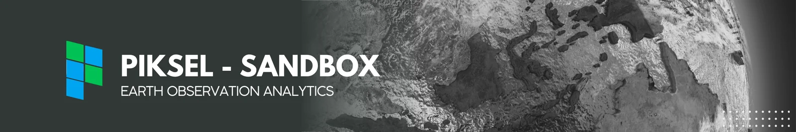

######



**Piksel Sandbox** adalah lingkungan cloud interaktif untuk mempelajari dan menganalisis data pengamatan Bumi di Indonesia dengan Open Data Cube.

## Seri Pembelajaran

::::{grid} 1 1 2 2

:::{grid-item-card} 01 Panduan Pemula
Pelajari dasar penggunaan JupyterLab, Open Data Cube, dan xarray, serta alur kerja analisis geospasial.

[Bahasa Indonesia](Indonesia/01_Panduan_Pemula/README.md) · [English](English/01_Beginners_Guide/README.md)
:::

:::{grid-item-card} 02 Panduan Produk Data
Pahami karakteristik setiap produk data pengamatan Bumi dan cara menggunakannya.

[Bahasa Indonesia](Indonesia/02_Panduan_Produk_Data/README.md) · [English](English/02_Data_Product_Guides/README.md)
:::

:::{grid-item-card} 03 Panduan Analisis
Pelajari metode penginderaan jauh dan analisis geospasial untuk berbagai kebutuhan.

[Bahasa Indonesia](Indonesia/03_Panduan_Analisis/README.md) · [English](English/03_Analysis_Guides/README.md)
:::

:::{grid-item-card} 04 Studi Kasus
Terapkan pengetahuan dari seri sebelumnya dalam alur kerja sains data geospasial yang lengkap.

[Bahasa Indonesia](Indonesia/04_Studi_Kasus/README.md) · [English](English/04_Case_Studies/README.md)
:::

::::

```{warning} Simpan pekerjaan dengan aman
Pembaruan tutorial dapat menimpa perubahan pada notebook. Sebelum mengedit, buat dan gunakan salinan notebook di luar folder tutorial. Berkas di ruang kerja tidak dijamin tersimpan secara permanen; cadangkan berkas penting ke penyimpanan eksternal.
```
